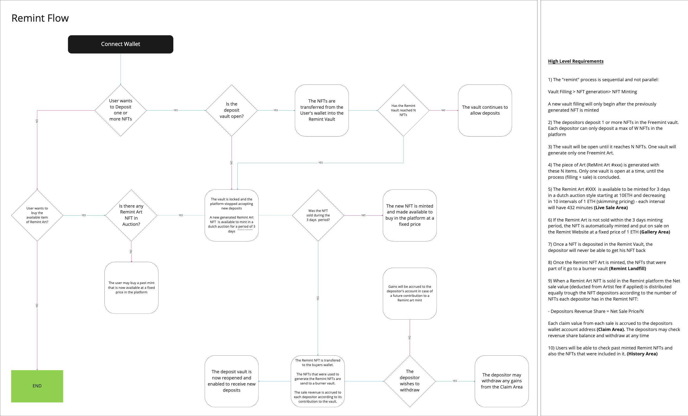

# remint
An NFT recycling project created during ETHLisbon 2022

*remint* creates the possibility for NFT holders to recycle the NFTs they do not want anymore. They can do this by joining vaults with other NFT holders.
Once the required number of NFTs in the vault is reached, the NFTs in the vault are burnt and a mosaic made from the burnt NFTs and minted as a new NFT.
The mosaic NFT is put for sale in a Dutch auction where anyone can participate. If the NFT is sold, the value is shares between all the NFT holders that
contributed to the vault in the proportion of the number of NFTs contributed. Each contributed NFT has the same weight in the vault.

Once the sale ends, a new vault is opened and the process starts again.

There are no royalties and no platform fees. The sale amount is shared entirely with the contributors of the vault.

## Flowchart

## Vision (Figma)
The vision for `remint` can be seen in the following [Figma](https://www.figma.com/file/pfed96kU08o69Umj5nE0j4/REMINT?node-id=0%3A1).
